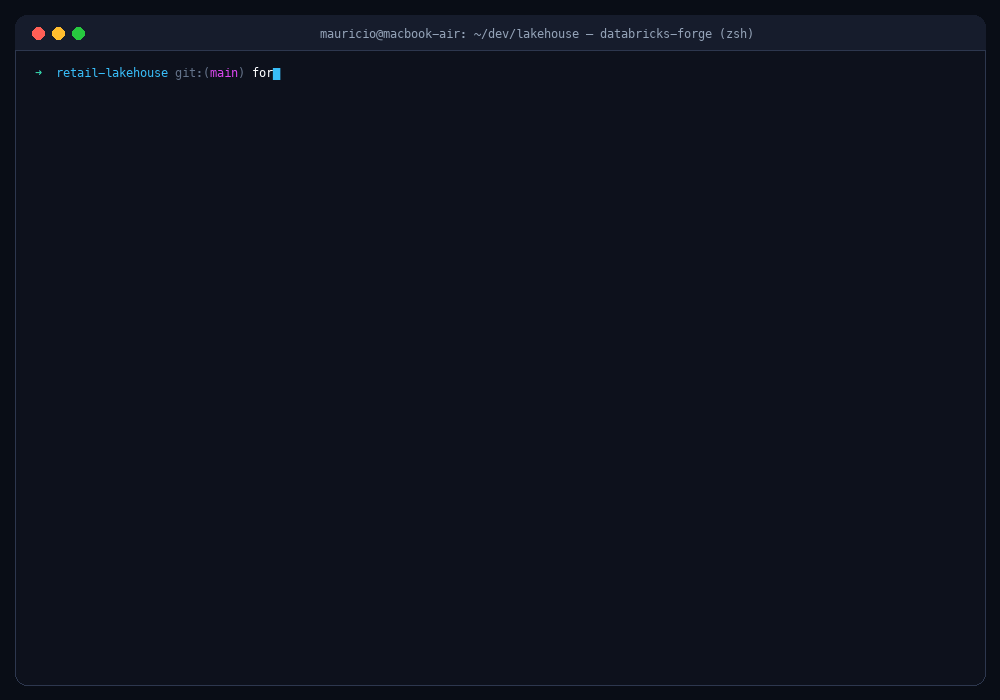
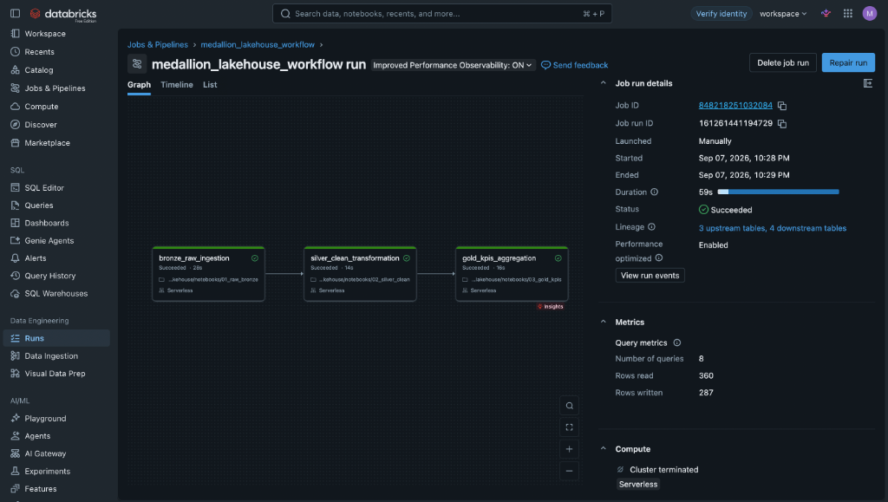

<div align="center">


# ⚡ Databricks Forge CLI

**Industrial-grade CLI for scaffolding, testing, packaging, DAG orchestrating, and deploying Lakehouse projects to Databricks Community Edition & Enterprise.**

[](https://www.python.org/)
[](https://spark.apache.org/)
[](https://delta.io/)
[](https://github.com/MrPowers/chispa)
[](LICENSE)
[](https://github.com/Helfstein-one/databricks-forge-cli/actions)

</div>

---

## 🎯 Visão Geral & Proposta de Valor

O **`databricks-forge-cli`** é a ferramenta definitiva de engenharia de dados moderna para criar, testar, orquestrar e implantar projetos PySpark e SQL no Databricks.

<div align="center">



*Demonstração da CLI em execução: banner 3D Cyberpunk, scaffolding automatizado, validação de DAG e catálogo de conectores.*

</div>

### Principais Pilares:
- 🎨 **CLI Visual & Interativa**: Banner ASCII 3D Cyberpunk neon (`DATABRICKS FORGE CLI // CYBERPUNK 3D`) e feedback rico no terminal via Rich.
- 📁 **Suporte a Múltiplos Formatos de Arquivo**: Ingestão, conversão e escrita contínua entre **Parquet**, **ORC**, **Avro**, **CSV**, **JSON/JSONL** e **Delta Lake** (`forge data convert`, `read_dataset()`, `write_dataset()`).
- 🔌 **Conectores de Banco de Dados & Reverse-ETL**: Ingestão paralela particionada via JDBC (Bronze) e exportação reversa (Gold) para **PostgreSQL**, **MySQL**, **SQL Server**, **Oracle**, **Snowflake**, **MongoDB**, **Google BigQuery** e **SQLite** com validação de conectividade via handshake TCP (`forge connector test-connection`, `read_database_table()`, `write_database_table()`).
- 🧊 **Apache Iceberg & Delta UniForm**: Geração nativa de metadados Iceberg sobre tabelas Delta Lake sem duplicação de dados (`delta.universalFormat.enabledFormats = 'iceberg'`), permitindo leitura aberta em Trino, Snowflake, AWS Athena e DuckDB, além de suporte a time-travel.
- ⚡ **Template Structured Streaming**: Ingestão contínua e micro-batch (`trigger(availableNow=True)`) com Delta Lake, watermarking de 10 minutos, janelas deslizantes/tumbling de 5 minutos e checkpoints tolerantes a falhas.
- 🚀 **Tuning & Otimização de Performance**: Comandos `forge tune` para compactação de arquivos Delta (`OPTIMIZE`), clustering multidimensional (`ZORDER BY`), limpeza segura de snapshots (`VACUUM`) e perfis de Spark AQE (`balanced`, `write_heavy`, `read_heavy`).
- 📊 **Logging Estruturado & Observabilidade**: Formatador JSON ISO 8601 para agregadores de logs (Datadog, CloudWatch), decorator de auditoria `@pipeline_audit_step` para medição automática de latência e contagem de linhas, e gravação em tabela Delta de auditoria (`pipeline_execution_audit`).
- 🌐 **Orquestração de Múltiplos Jobs em DAG**: Defina grafos de tarefas com dependências (`depends_on`) no `workflow.yaml`, com validação topológica, detecção de ciclos e geração de **Master DAG Runner** para o Databricks Community Edition ou payload nativo da Jobs API v2.1.
- 💼 **Execução Remota de Jobs & Serverless Workflows**: Orquestre pipelines multi-tarefa diretamente no Databricks via Jobs API v2.1 (`forge job run-dag`, `forge dag submit`) com suporte nativo a **Serverless Compute** e streaming em tempo real do status de execução.
- 🗄️ **Suporte Nativo a Jobs SQL**: Execute scripts `.sql` localmente em Delta Lake ou faça deploy de consultas diretamente no Databricks Workspace.
- 💻 **Catálogo de Máquinas & Compute**: Escolha nós para **AWS** (`i3.xlarge`, `m5d.large`), **Azure** (`Standard_DS3_v2`, `D4s_v5`), **GCP** (`n1-standard-4`) e **Community Edition** (`SingleNode` gratuito, 0 workers).
- 🔒 **Secrets & Variáveis de Ambiente**: Sincronização automática do arquivo local `.env` com os Secret Scopes do Databricks (`forge secret sync-env`) e função híbrida `get_secret(scope, key)`.
- 🐳 **Ambiente Docker Local**: Desenvolva e teste com PySpark 3.5, Delta Lake 3.0 e Chispa com volume local persistente sem custo de cloud.
- 🔌 **Databricks Connect v2**: Alterne para modo remoto com `EXECUTION_MODE=remote` conectando sua IDE diretamente ao cluster ativo.

---

## 🏛️ Desenho de Solução & Arquitetura

O projeto conta com uma arquitetura modelada em 3 perspectivas integradas:


### 📑 Estrutura Multi-Aba no Draw.io ([`docs/architecture.drawio`](docs/architecture.drawio))

O arquivo [`docs/architecture.drawio`](docs/architecture.drawio) foi totalmente reconstruído e contém **3 abas dedicadas**, prontas para visualização no [diagrams.net (Draw.io)](https://app.diagrams.net/):

1. **Aba 1: Experiência do Desenvolvedor (Funcional)**: Mapeamento completo da jornada do engenheiro de dados: scaffolding inteligente (`forge init`), gestão segura de secrets (`forge secret sync-env`), ingestão multi-banco com catálogo JDBC (`forge connector`), desenvolvimento local e testes unitários Chispa com custo zero de DBU, tunning Delta & Apache Iceberg UniForm (`forge tune` & `forge iceberg`), orquestração de DAG multi-job (Algoritmo de Kahn), esteira CI/CD e execução remota na nuvem (`forge job run-dag`).
2. **Aba 2: Visão de Negócio, FinOps & Governança**: 4 pilares estratégicos de valor: FinOps com redução de 80% a 90% em custos de computação de desenvolvimento e tarifação por segundo via Serverless, aceleração de time-to-market (< 5 min), governança corporativa unificada com Unity Catalog e interoperabilidade total sem lock-in com Delta Lake + Apache Iceberg UniForm; além da cadeia de valor Medallion e matriz comparativa de ROI.
3. **Aba 3: Solução de Dados (Databricks & AWS com Ícones Oficiais)**: Arquitetura técnica de solução de dados ponta a ponta com **ícones oficiais Databricks e AWS**: Ingestão (AWS RDS/Aurora, Enterprise DB, AWS Kinesis, AWS S3 Landing Zone), Orquestração e Segurança (AWS Secrets Manager, AWS IAM, Databricks Control Plane Jobs API v2.1), Computação Lakehouse (Databricks Serverless Compute, AWS EC2 i3.xlarge, Apache Spark 3.5), Armazenamento Medallion & Governança (Databricks Unity Catalog, S3 Bronze/Silver/Gold Delta Lake e Apache Iceberg UniForm) e Consumo Analítico (Databricks SQL, AWS Athena Serverless, Amazon Redshift Spectrum e AWS CloudWatch).

---

## 📦 Instalação

```bash
# Instalação direta via pip do repositório
pip install git+https://github.com/Helfstein-one/databricks-forge-cli.git

# Ou clone para desenvolvimento local
git clone https://github.com/Helfstein-one/databricks-forge-cli.git
cd databricks-forge-cli
pip install -e ".[dev]"
```

Comandos disponíveis no terminal: `forge` ou `databricks-forge`.

---

## 🚀 Guia Rápido (Quickstart)

### 1. Criar um Novo Projeto com Compute & Banner ASCII
```bash
forge init retail-lakehouse --cloud aws --node-type i3.xlarge --workers 2
cd retail-lakehouse
```
Ao rodar, o banner ASCII 3D Cyberpunk neon **`DATABRICKS FORGE CLI // CYBERPUNK 3D`** é exibido no terminal e o scaffolding completo é montado.

### 2. Validar e Executar o Grafo de Tarefas (DAG)
```bash
# Valida se o workflow.yaml não possui dependências circulares
forge dag validate

# Executa o grafo de tarefas em ordem topológica (Wheel -> SQL -> Notebook)
forge dag run --mode local
```

### 3. Gerenciar Secrets e Variáveis de Ambiente
```bash
# Sincroniza seu .env local diretamente com um Secret Scope no Databricks
forge secret sync-env --scope-name "retail_scope"

# Lista scopes existentes no Databricks
forge secret list
```

No código Python do projeto, utilize a função universal `get_secret`:
```python
from retail_lakehouse.secrets import get_secret

# No Databricks lê via dbutils.secrets.get("retail_scope", "api_key")
# Localmente ou em Docker lê via os.getenv("API_KEY") do seu .env
api_key = get_secret("retail_scope", "api_key")
```

### 4. Executar e Implantar Scripts SQL
```bash
# Executa localmente contra o Delta Lake
forge sql run sql/01_clean_transactions.sql

# Faz deploy no Databricks Workspace
forge sql deploy sql/01_clean_transactions.sql --target-path "/Shared/retail_lakehouse/sql/clean"
```

### 5. Compilar o Wheel e Fazer o Deploy no Databricks CE
```bash
forge build
forge deploy --target-path "/Shared/forge_deployments/retail_lakehouse"
```

### 6. Executar Ingestão Streaming com Delta Lake & Watermarking
O projeto scaffolded vem com template completo de **Structured Streaming**:
```bash
# Executa localmente em modo micro-batch (AvailableNow)
make stream-run
```
No Databricks CE, execute o notebook `notebooks/run_streaming_notebook.py` com widgets interativos:
- **`trigger_mode`**: `available_now` (ótimo para agendamentos econômicos), `continuous`, ou `processing_time`.
- **`watermark_delay`**: atraso tolerado para dados tardios (ex: `10 minutes`).
- **`checkpoint_dir`**: diretório de checkpoint para garantia *exactly-once*.

### 7. Otimização de Performance Delta & Spark AQE
```bash
# Inspeciona perfis de configuração recomendados (AQE, Auto-Compact, Coalescing)
forge tune config --profile balanced

# Gera o plano de compactação (OPTIMIZE) com Z-ORDER em colunas de alta cardinalidade
forge tune optimize transactions_silver --zorder user_id,date

# Gera rotina de expurgo seguro de snapshots históricos (VACUUM)
forge tune vacuum transactions_silver --retention 168
```

### 8. Logging Estruturado & Auditoria de Pipelines
O módulo `logging.py` do projeto scaffolded fornece telemetria pronta para produção:
```python
from retail_lakehouse.logging import setup_pipeline_logging, pipeline_audit_step

# Configura logs em formato JSON padronizado ISO 8601
logger = setup_pipeline_logging(level="INFO", json_format=True)

# Decorator mede latência automaticamente, conta linhas de DataFrames e registra falhas
@pipeline_audit_step(step_name="transform_silver_customers")
def process_customers(df):
    return df.filter("active = true")
```
As métricas também podem ser persistidas na tabela Delta `pipeline_execution_audit`.

### 9. Conversão & Inspeção Multi-Formato (`forge data`)
Ingira e converta arquivos entre qualquer formato aberto:
```bash
# Inspeciona metadados, formato inferido e tamanho do arquivo ou diretório
forge data inspect raw/transactions.parquet

# Gera o plano de conversão direta de CSV para Delta Lake particionado
forge data convert raw/events.csv data_lake/silver_events --from csv --to delta -p date,category
```
No código Python:
```python
from retail_lakehouse.formats import read_dataset, write_dataset

# Lê automaticamente Parquet, ORC, Avro, CSV ou JSON
df = read_dataset(spark, "raw/events.avro")

# Salva em Delta Lake com particionamento
write_dataset(df, "silver_events", format="delta", partition_by=["date"])
```

### 10. Tabelas Apache Iceberg & Delta UniForm (`forge iceberg`)
Habilite interoperabilidade aberta gerando metadados Apache Iceberg em tabelas Delta Lake sem custos de duplicação:
```bash
# Ativa Delta UniForm Iceberg na tabela Silver
forge iceberg enable-uniform transactions_silver

# Inspeciona caminhos de metadados Iceberg e motores compatíveis (Trino, Athena, Snowflake)
forge iceberg inspect transactions_silver

# Gera query para inspeção de histórico de snapshots para time-travel
forge iceberg snapshots transactions_silver
```
No Databricks CE, execute o notebook `notebooks/run_multiformat_notebook.py` para visualizar a ingestão heterogênea e ativação do UniForm em tempo real.

### 11. Conectores de Bancos de Dados & Reverse-ETL (`forge connector`)
Integre até 8 bancos de dados relacionais, NoSQL e data warehouses externos (PostgreSQL, MySQL, SQL Server, Oracle, Snowflake, MongoDB, BigQuery, SQLite):
```bash
# Lista todos os motores de banco de dados suportados, drivers e portas padrão
forge connector list

# Testa reachability de rede e handshake TCP antes de agendar pipelines
forge connector test-connection postgresql --host db.internal --port 5432

# Planeja ingestão paralela de tabela externa particionada para a camada Bronze Delta
forge connector plan-ingest postgresql customers bronze_customers -d prod_db -p id -n 8 --fetchsize 5000

# Planeja exportação reversa (Reverse-ETL) da camada Gold Delta para banco operacional
forge connector plan-export gold_kpis mysql kpi_dashboard -d analytics_db -m overwrite --batchsize 2000
```
No código Python do projeto:
```python
from retail_lakehouse.connectors import read_database_table, write_database_table

# Ingestão paralela de PostgreSQL com credenciais seguras via Secret Scope
df_customers = read_database_table(
    spark,
    db_type="postgresql",
    table_name="public.customers",
    partition_column="customer_id",
    num_partitions=8,
)

# Reverse-ETL: exporta tabela Gold refinada para MySQL operacional
write_database_table(
    df_kpis,
    db_type="mysql",
    target_table="sales_kpis",
    mode="overwrite",
    batchsize=2000,
)
```
No Databricks CE, execute o notebook interativo `notebooks/run_database_connectors_notebook.py` para testar ingestão e Reverse-ETL com widgets configuráveis.

### 12. Execução Remota de Jobs & Workflows Serverless (`forge job`)
Execute pipelines completos na nuvem da Databricks com resolução topológica de dependências e monitoramento em tempo real:
```bash
# 1. Executa e transmite o status de todas as tarefas da DAG no Databricks
forge job run-dag --file workflow.yaml --workspace-base /Shared/my_project --serverless

# 2. Ou registre a DAG via Jobs API v2.1 para execuções agendadas
forge job create --file workflow.yaml --serverless

# 3. Dispare manualmente uma execução por ID e acompanhe o progresso
forge job run <job_id>
```

### 13. Exemplo Completo Medallion Architecture (`examples/medallion_lakehouse`)
O repositório inclui uma implementação de referência de arquitetura Medallion ponta a ponta pronta para execução em nuvem:

<div align="center">



*Execução real do pipeline multi-tarefa em Databricks Serverless Compute (Job ID: `848218251032084`, Run ID: `161261441194729`)*

</div>

Para executar este exemplo diretamente no seu workspace:
```bash
forge job run-dag --file examples/medallion_lakehouse/workflow.yaml --workspace-base /Shared/medallion_lakehouse --serverless
```
Consulte o guia completo em [`examples/medallion_lakehouse/README.md`](examples/medallion_lakehouse/README.md).

---

## 🧰 Referência Completa de Comandos

### Comandos Centrais
| Comando | Descrição |
|---|---|
| `forge init <name>` | Gera novo projeto Lakehouse com DAG, Docker, Chispa, Streaming, Formatos e CI/CD |
| `forge build` | Compila o pacote `.whl` do projeto |
| `forge deploy` | Envia Wheel, SQLs e Master DAG Runner para o Databricks Workspace |
| `forge check` | Diagnóstico de pré-requisitos (Python, Java, Docker, Databricks API) |
| `forge run-notebook` | Gera URL direta e guia de execução para o notebook no Databricks CE |

### Jobs Remotos & Serverless (`forge job`)
| Comando | Descrição |
|---|---|
| `forge job run-dag` | Registra, dispara e transmite execução multi-tarefa em tempo real na nuvem |
| `forge job create` | Cria ou atualiza workflow na Jobs API v2.1 (Serverless ou Job Cluster) |
| `forge job run <job_id>` | Dispara execução de job existente e exibe URL de monitoramento |
| `forge dag submit` | Atalho para submeter e executar a DAG remotamente no Databricks |

### Conectores de Bancos de Dados (`forge connector`)
| Comando | Descrição |
|---|---|
| `forge connector list` | Lista catálogo com os 8 bancos de dados suportados, drivers e portas |
| `forge connector test-connection <db_type>` | Testa handshake TCP de rede para validar portas e firewalls |
| `forge connector plan-ingest <db_type>` | Gera código de ingestão JDBC paralela particionada para Delta |
| `forge connector plan-export <db_type>` | Gera código de exportação em lote Reverse-ETL de Delta para BD externo |

### Multi-Formatos (`forge data`)
| Comando | Descrição |
|---|---|
| `forge data convert <src> <tgt>` | Converte datasets entre Parquet, ORC, Avro, CSV, JSON e Delta |
| `forge data inspect <path>` | Inspeciona formato inferido, tamanho e presença de Delta log |

### Apache Iceberg (`forge iceberg`)
| Comando | Descrição |
|---|---|
| `forge iceberg enable-uniform <table>` | Ativa Delta UniForm para geração de metadados Apache Iceberg |
| `forge iceberg inspect <table>` | Inspeciona metadados Iceberg e motores externos compatíveis |
| `forge iceberg snapshots <table>` | Gera query para histórico de commits e snapshots Iceberg |

### Tuning & Otimização (`forge tune`)
| Comando | Descrição |
|---|---|
| `forge tune optimize <table>` | Gera e executa plano de compactação (`OPTIMIZE`) com `ZORDER BY` |
| `forge tune vacuum <table>` | Gera e executa plano de retenção e limpeza de arquivos obsoletos (`VACUUM`) |
| `forge tune config` | Exibe parâmetros ótimos de Spark AQE, Auto-Compaction e Shuffling |

### DAG & Workflows (`forge dag`)
| Comando | Descrição |
|---|---|
| `forge dag validate` | Valida o grafo, resolve dependências e detecta ciclos |
| `forge dag run` | Executa localmente as tarefas na ordem topológica resolvida |
| `forge dag export` | Exporta o DAG para payload JSON nativo da Databricks Jobs API v2.1 |

### Jobs SQL (`forge sql`)
| Comando | Descrição |
|---|---|
| `forge sql run <file.sql>` | Executa script SQL em PySpark Local Delta ou Databricks Connect |
| `forge sql deploy <file.sql>` | Publica o script SQL no Workspace da Databricks |

### Secrets & .env (`forge secret`)
| Comando | Descrição |
|---|---|
| `forge secret list` | Lista Secret Scopes ou chaves em um scope |
| `forge secret create-scope <name>` | Cria um novo Secret Scope no Databricks |
| `forge secret set <scope> <key>` | Define um secret de forma segura |
| `forge secret sync-env` | Sincroniza chaves do `.env` local para o Databricks Secret Scope |

### Compute & Máquinas (`forge compute`)
| Comando | Descrição |
|---|---|
| `forge compute list --cloud aws` | Lista nós suportados da AWS (i3.xlarge, m5d, c5, r5) |
| `forge compute list --cloud azure` | Lista VMs Azure (Standard_DS3_v2, D4s_v5, E4ds_v4) |
| `forge compute list --cloud gcp` | Lista instâncias GCP (n1-standard, n2-highmem) |
| `forge compute list --cloud ce` | Exibe perfil Single-Node gratuito do Community Edition |

---

## 🌐 Exemplo de Orquestração: `workflow.yaml`

```yaml
name: "ecommerce_pipeline_dag"
description: "Pipeline Medallion com Python Wheel, SQL e Notebook"

compute:
  cloud: "aws"
  node_type_id: "i3.xlarge"
  spark_version: "14.3.x-scala2.12"
  single_node: false
  num_workers: 2

tasks:
  - name: "ingest_bronze"
    type: "python_wheel"
    entrypoint: "ecommerce.entrypoint:main"
    parameters:
      rows: 1000

  - name: "clean_silver_sql"
    type: "sql"
    depends_on: ["ingest_bronze"]
    file: "sql/01_clean_transactions.sql"

  - name: "aggregate_gold_sql"
    type: "sql"
    depends_on: ["clean_silver_sql"]
    file: "sql/02_gold_metrics.sql"

  - name: "analytics_dashboard"
    type: "notebook"
    depends_on: ["aggregate_gold_sql"]
    path: "notebooks/run_pipeline_notebook.py"
```

---

## 🧪 Testes Automatizados

A CLI conta com cobertura de testes unitários e de integração:

```bash
# Executa todos os testes
pytest tests/ -v
```

---

## 📄 Licença

Este projeto é distribuído sob a licença [Apache 2.0](LICENSE).
