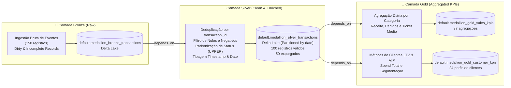

# 🏅 End-to-End Medallion Lakehouse Workflow (Bronze ➔ Silver ➔ Gold)

Exemplo de referência pronto para produção demonstrando a implementação completa da **Medallion Architecture** utilizando o **`databricks-forge-cli`**, implantado e executado na nuvem com **Databricks Serverless Compute**.

<div align="center">


*Execução real do workflow multi-tarefa no Databricks (Job ID: `848218251032084`, Run ID: `161261441194729`)*

</div>

---

## 🏛️ Arquitetura do Pipeline



---

## 📁 Estrutura de Arquivos

```text
examples/medallion_lakehouse/
├── assets/
│   └── databricks_medallion_workflow_run.png  # Screenshot da execução real no Databricks
├── notebooks/
│   ├── 01_raw_bronze.py                       # Ingestão de dados brutos para tabela Bronze Delta
│   ├── 02_silver_clean.py                     # Higienização, deduplicação e particionamento Silver
│   └── 03_gold_kpis.py                        # Agregações de negócio, KPIs e segmentação VIP Gold
├── workflow.yaml                              # Especificação declarativa do Grafo de Tarefas (DAG)
└── README.md                                  # Guia detalhado de arquitetura e execução
```

---

## ⚡ Descrição das Etapas do Workflow

### 1. 🥉 Camada Bronze: Ingestão de Dados Brutos (`01_raw_bronze.py`)
- **Objetivo**: Ingerir eventos transacionais no formato original sem perda de dados históricos, incluindo registros propositadamente "sujos" (valores negativos, status nulos) para teste de resiliência.
- **Auditoria**: Adiciona metadados de ingestão com `_ingested_at = current_timestamp()`.
- **Tabela de Destino**: `default.medallion_bronze_transactions` (150 linhas).

### 2. 🥈 Camada Silver: Limpeza, Deduplicação e Validação de Qualidade (`02_silver_clean.py`)
- **Dependência**: Executa automaticamente após o sucesso da tarefa `bronze_raw_ingestion`.
- **Regras de Qualidade**:
  - Deduplicação estrita via `.dropDuplicates(["transaction_id"])`.
  - Expurgo de transações com montante negativo ou nulo (`amount > 0.0`).
  - Padronização de strings (`status` em caixa alta e sem espaços residuais).
  - Filtragem de status válidos (`COMPLETED`, `PENDING`, `REFUNDED`).
  - Conversão de string ISO para `TimestampType` e extração de coluna temporal `date`.
  - Timestamp de processamento `_silver_processed_at`.
- **Tabela de Destino**: `default.medallion_silver_transactions` (100 linhas válidas, 50 descartadas).
- **Otimização**: Particionada por `date`.

### 3. 🥇 Camada Gold: KPIs de Vendas e Perfil de Clientes VIP (`03_gold_kpis.py`)
- **Dependência**: Executa automaticamente após o sucesso da tarefa `silver_clean_transformation`.
- **Métricas Analíticas**:
  1. **Performance Diária de Vendas (`medallion_gold_sales_kpis`)**:
     - `total_revenue`: Soma do faturamento por data e categoria.
     - `total_orders`: Volume consolidado de transações aprovadas.
     - `avg_order_value`: Ticket médio por pedido.
     - `unique_customers`: Contagem de clientes únicos.
  2. **Segmentação e LTV de Clientes (`medallion_gold_customer_kpis`)**:
     - `lifetime_spend`: Gasto histórico acumulado por usuário.
     - `lifetime_orders`: Total de compras efetuadas.
     - `avg_spend_per_order`: Valor médio gasto por pedido.
     - `is_vip`: Flag booleana para clientes de alto valor (`lifetime_spend >= 1000.0`).

---

## 🚀 Como Executar o Exemplo

### Pré-requisitos
Defina as variáveis de ambiente com os dados do seu workspace Databricks:
```bash
export DATABRICKS_HOST="https://<seu-workspace>.cloud.databricks.com"
export DATABRICKS_TOKEN="dapi..."
```

### 1. Validar a DAG Localmente
Valide o grafo de dependências e confira a ordem topológica de execução com a CLI:
```bash
forge dag validate --file workflow.yaml
```

### 2. Executar Remotamente no Databricks com Serverless
O comando `forge job run-dag` compila os metadados da DAG, registra o Job na **Jobs API v2.1**, dispara a execução e transmite o status de cada etapa em tempo real:
```bash
forge job run-dag --file workflow.yaml --workspace-base /Shared/medallion_lakehouse --serverless
```

### 3. Consultar os Resultados no Databricks SQL
Execute a seguinte consulta no **Databricks SQL Editor** para auditar as contagens de linhas por camada:
```sql
SELECT 'Bronze' AS layer, count(*) AS total_rows FROM default.medallion_bronze_transactions
UNION ALL
SELECT 'Silver' AS layer, count(*) AS total_rows FROM default.medallion_silver_transactions
UNION ALL
SELECT 'Gold (Sales KPIs)' AS layer, count(*) AS total_rows FROM default.medallion_gold_sales_kpis
UNION ALL
SELECT 'Gold (Customer KPIs)' AS layer, count(*) AS total_rows FROM default.medallion_gold_customer_kpis;
```

---

## 📊 Métricas da Execução Real no Databricks

| Métrica | Valor Registrado |
|---|---|
| **Job Name** | `medallion_lakehouse_workflow` |
| **Job ID** | `848218251032084` |
| **Job Run ID** | `161261441194729` |
| **Tipo de Compute** | Databricks Serverless Compute |
| **Duração Total** | **59 segundos** |
| **Status Final** | 🟢 **Succeeded** |
| **Consultas Executadas** | 8 |
| **Linhas Lidas / Escritas** | 360 / 287 |
